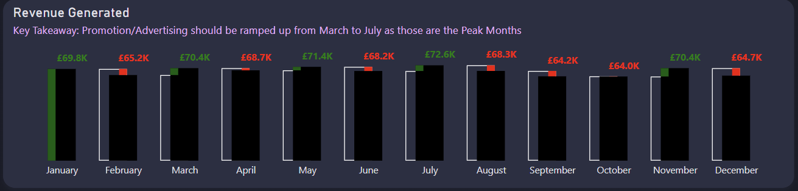

[Maven Pizza Challenge](https://mavenanalytics.io/challenges/maven-pizza-challenge/4)

Interact it with it here: [Novypro Interactive Link](https://www.novypro.com/project/maven-pizza-challenge-18)

## The Brief

For the Maven Pizza Challenge, you’ll be playing the role of a BI Consultant hired by Plato's Pizza, a Greek-inspired pizza place in New Jersey. You've been hired to help the restaurant use data to improve operations, and just received the following note:

Welcome aboard, we're glad you're here to help!

Things are going OK here at Plato's, but there's room for improvement. We've been collecting transactional data for the past year, but really haven't been able to put it to good use. Hoping you can analyze the data and put together a report to help us find opportunities to drive more sales and work more efficiently.

Here are some questions that we'd like to be able to answer:

- What days and times do we tend to be busiest? - How many pizzas are we making during peak periods? - What are our best and worst selling pizzas? - What's our average order value? - How well are we utilizing our seating capacity? (we have 15 tables and 60 seats)

That's all I can think of for now, but if you have any other ideas I'd love to hear them – you're the expert!

Thanks in advance, Mario Maven (Manager, Plato's Pizza)

For this challenge, your task is to __build a single-page dashboard based on Mario's email to help him improve the restaurant's operation__s.

## Modelling

## Dashboard Components & Key Takeaways

# Dashboard Components

## MoM Change in Pizza Revenue

- **Visual Type**: IBCS compliant column chart.
- **Features**: Tooltip page displaying orders and revenue for each month, values for the previous month, percentage difference, and color-coded direction, along with QTD and YTD values for both metrics.

- **Key Takeaway**: Increase promotion/advertising efforts from March to July to capitalize on peak revenue months.

## Heatmap of Orders

- **Visual Type**: Heatmap.
- **Features**: Days of the week on rows and hours of the day in columns. Bookmarks allow toggling between average and total orders.
- **Key Takeaway**: Lunch times and office closing times are peak periods. Service should be optimized for these times to improve customer experience and sales.

## Average Quantities Ordered per Hour

- **Visual Type**: Column chart.
- **Features**: Displays average quantities ordered in each 1-hour bucket, indicating the number of people present in the restaurant within an hour.
- **Key Takeaway**: Seating capacity is under-utilized, with fewer than 20 seats occupied out of 60 during peak times. This suggests room for increasing customer footfall and improving seating efficiency.

## Pizza Category Revenue and Orders

- **Visual Type**: Donut chart.
- **Features**: Four categories of pizza shown with revenue; order details included as a tooltip.
- **Key Takeaway**: Identifies best and worst-performing pizza categories, informing menu adjustments and promotional strategies.

## Best and Worst Selling Pizzas

- **Visual Type**: Bar chart.
- **Features**: Displays top best-selling and low-performing pizzas, controlled by a Top N filter. Each bar is broken down by the sizes ordered.
- **Key Takeaway**: Enables focused improvement on pizza offerings and marketing for low-performing pizzas while capitalizing on best-sellers.

## Key Metrics Cards

- **Visuals**: Three cards displaying total revenue, total orders, and average order value.
- **Purpose**: Provides a snapshot of overall business performance, aiding in quick assessment and decision-making.

# Business Questions Addressed

- **Peak Operating Times**: Identified through the heatmap and average quantities ordered, guiding staffing and service focus.
- **Sales Performance**: Insight into best and worst-selling pizzas and revenue changes month over month, supporting menu optimization and targeted promotions.
- **Operational Efficiency**: Analysis of seating capacity utilization offers opportunities for improving customer turnover and satisfaction.
- **Strategic Planning**: Revenue and order metrics assist in setting performance benchmarks and forecasting.

# Recommendations

Based on the data analysis, several strategic actions are recommended to drive sales and enhance operational efficiency:

- **Increase Marketing Efforts**: Specifically target months with historically higher sales (March to July) with targeted advertising and promotions.
- **Optimize Service for Peak Times**: Adjust staffing and kitchen operations to better serve customers during identified peak hours, enhancing customer experience and potentially increasing sales.
- **Menu Optimization**: Focus on promoting best-selling pizzas and consider revising or marketing low-performing pizzas differently.
- **Improve Seating Efficiency**: Investigate strategies to increase footfall during under-utilized times, potentially through specials or events, to make better use of available seating.
